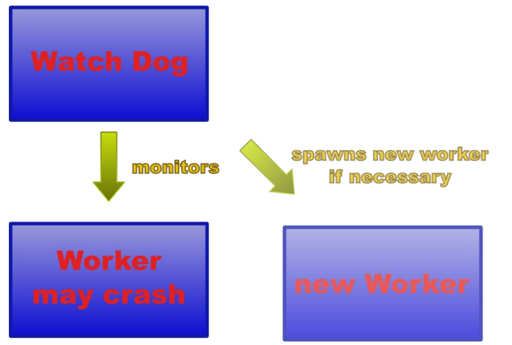
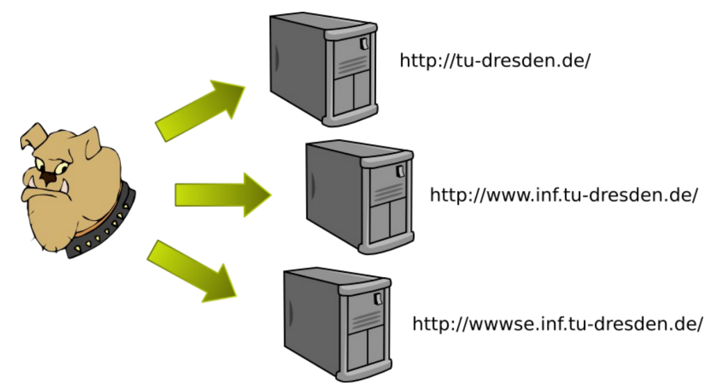

# Process Pairs - Watchdog

You have already dealt with an unreliable program in task "ROC", where the faults occur deterministically. You already know how to analyze and to harden your environment. But those are not the only reasons for that an application might crash. One further reason could be a library that your application depends on crashes non-deterministically. This crashes your application, too.It is unacceptable for an long running service to be restarted by a system administrator by hand after each crash. Instead the service implementation has to cope with this.

You shall implement the "process pair" approach to harden our watch dog service.

## Process Pair approach

The approach is to have a pair of processes: a worker and a watch dog. The worker is your regular service. The watch dog process waits for the worker to crash. It spawns an new worker process immediately after the original has worker crashed.

### Implementation

The watch dog and the worker are implemented in the same executable file. When the application starts the watch dog must be active. It uses `fork` to spawn a new process. The new process is the worker and is responsible for providing the service, i.e., the purpose of the application. It starts running the implemented service in an endless loop.

The watch dog process uses `waitpid` to wait until the worker process ends. When `waitpid` returns the worker has crashed and the task of the watchdog is to spawn a new one and maybe to write some error log including the reasons for the crash (signal that killed the worker).



### Enhancements

You have to implement two enhancements in addition to the central approach: Graceful degradation and Check-pointing.

#### Graceful degradation

It might happen that `fork` fails. A possible reason is a overloaded system with too few resources to spawn a new process. If the watch dog terminates there will be no service at all. But if the watch dog serves the service as a worker you will have service until the worker crashes. That is called graceful degradation.

As a matter of fact graceful degradation is more general: it means that you degrade your service as little as possible if your are out of resources.

#### Check-pointing

Each time your worker crashes it loses its state. If the state is important to the service, this might be unacceptable. One solution is to have a so called hard state: you store your state in a way that it survives a crash. You can implement this by writing your current state to hard disc on each change. Such a state is also called check-point.

Before a newly created worker starts to run its service, it looks on hard disc for a check-point. It loads its state form this check-point if it exists.

Your hard-state should be small and change only with a low frequency. Otherwise the check-pointing will have a negative influence on the performance of your service.

## Your Task

We provide you with a web server watch dog implementation. You have to add the process pair approach to make it more reliable.


### The Web Server Watch Dog

Our service is a web server watch dog. Do not confuse it with the watch dog of the process pair approach. The web server watch dog has a list of URLs, a timeout and a sleep time value. It queries a URL and waits for a response at most until a timeout is triggered. If it gets no response, it prints an error message. Then it waits for a certain sleep time and after that it starts querying the next URL.



The sleep time takes care that the web servers been watched are not overloaded by the watch dog.

#### Functioning

The following paragraph shows an sample run of our watch dog. The URL list is in `url.lst` the timeout for each test is 2 seconds and the sleep time between two successive tests is 5 seconds.
```
#> ./watch_dog url.lst 2000 5000
URL file = url.lst
timeout = 2000 ms
pause = 5000 ms
host = [http://www.heise.de;](http://www.heise.de;) uri =
/security/dienste/browsercheck/tests/activex.shtml
host = wwwse.inf.tu-dresden.de; uri = /
host = wwwse.inf.tu-dresden.de; uri = /does_not_exist.html
host = [http://www.does.not.exist;](http://www.does.not.exist;) uri = /
===> Successful response from host [http://www.heise.de](http://www.heise.de)
(193.99.144.85): HTTP/1.1 200 OK
===> Successful response from host wwwse.inf.tu-dresden.de
(141.76.44.180): HTTP/1.1 200 OK
===> Host wwwse.inf.tu-dresden.de(141.76.44.180) does not respond
with "success"
===> response line: HTTP/1.1 404 Not Found


===> Could not find host [http://www.does.not.exist](http://www.does.not.exist)
===> Reason: Invalid argument
```

**_Attention_** : Do not change any output starting with "===>". These lines are parsed by our checking system.

#### Components

Our watch dog is written in C++. The source code of our watch dog is in `watch_dog.cc`. Use our `Makefile` to build. The `Makefile` contains also a run target, that uses the URL list `url.lst`.

Class Socket encapsulates a socket as scoped object (see task 2). The `struct` `URL` stores a host and a URI on the host to look after. All other components of the URL are omitted for simplicity. They are assumed to have standard values like HTTP or port 80. The function `read_url_list` parses a URL list file and returns a list of URL structures. Function `test_server` sends requests to a given server, waits for a reply, and prints the result to `stdout`. This function invokes library routines, that might crash the watch dog. The main program parses a URL list from a given file, iterates over it and tests each URL.

An URL list file looks like this:

- [http://www.heise.de/security/dienste/browsercheck/tests/activex.shtml](http://www.heise.de/security/dienste/browsercheck/tests/activex.shtml)
- [http://wwwse.inf.tu-dresden.de/](http://wwwse.inf.tu-dresden.de/)
- [http://wwwse.inf.tu-dresden.de/does_not_exist.html](http://wwwse.inf.tu-dresden.de/does_not_exist.html)
- [http://www.does.not.exist/](http://www.does.not.exist/)

### Motivation

The watch dog itself has no _known_ bugs. But the underlying TCP/IP implementation is unreliable and there is no way to fix it up.

So you have to add the process pair approach to our watch dog to make it tolerant against such crashes. Furthermore we want to watch all URLs on an uniform level. So you need to implement check-pointing. A new web server watch dog starts querying the URL that the crashed worker would have tested next.

The graceful degradation makes your implementation more robust against overloaded environments.

### Testing your implementation

To test your simulation you have to simulate library crashes. Therefore we give you an fault injector. It combines the approaches from task 4 and 5. First it uses the `LD_PRELOAD` approach from task 5 to wrap some library functions. The wrappers may crash by a certain hard coded probability. In other words it injects failures like in task 4.

The fault injector implementation will only work on x86 Linux. It consists of a `Makefile` and `fault_injector.cc`. You do not need to fully understand the fault injectors source code, but you have to know how to use it:

1. compile it

2. start your watch dog implementation with the preloaded fault injector:

    `LD_PRELOAD=<path to fault injector lib> ./watch_dog <cmdline-args>`

3. adjust the crash_treshhold in `fault_injector.cc` (lower values (between [0.0, 1,0) give a lower likelihood of a crash)

If you do not have access to an x86 Linux computer, you can test your implementation by killing the worker. The watch dog will instantaneously spawn a new worker. Use the *inx command `kill` or the Windows Task Manager for killing the worker. Therefore it might be useful to print out the PID of the worker, when it starts (see `getpid()`).

### Hints

- make yourself familiar with our implementation
- the main program contains the worker part
- you only need to change the main function and to add some helper functions
- the next URL to test should be the hard state
- let the watch dog read the URL list, the worker will inherit it via fork
- use our fault injector to test your implementation (or kill the worker from a second terminal)
- fork as rarely as possible
- do not change the format of the command line arguments or the format of the `url.lst` file
- do not change any output that starts with `TEST_PREFIX == "===>"`

## Organizational Remarks

### No online Grader (From WS20/21)

This time, we do not provide you with any grader. We will take your latest commit on the repository and grade it manually. Therefore, it is important for you to fully understand the task and test it locally. You may see in the pipeline that it might be successfully built and tested your repo, however, we will not take that information into account.

### Directory Structure

We require a specific directory structure for your solutions.
`process_pair/`
- `fault_injector/` - the code of the fault injector
    - `fault_injector.cc` - C++ code of fault injector
    - `Makefile` - fault injectors make file
-` watch_dog.cc` - our watch dog – add process pair approach
- `Makefile` - Makefile for our watch dog
- `url.lst `- list of URLs to test
